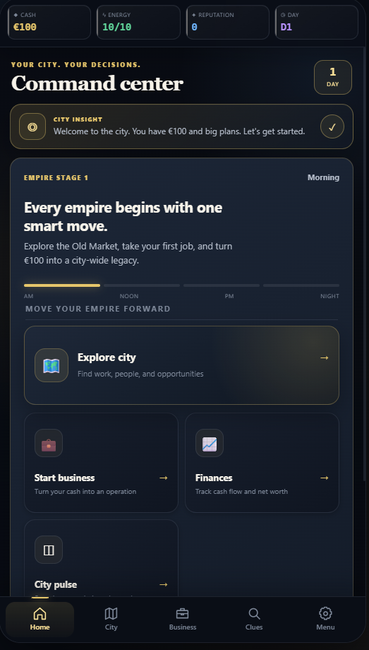
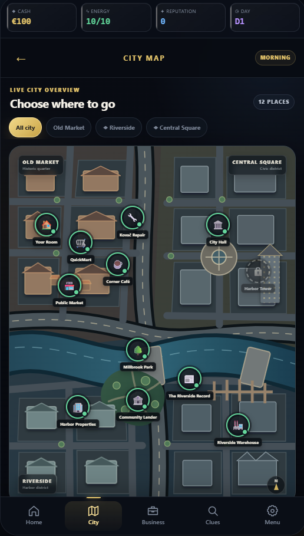
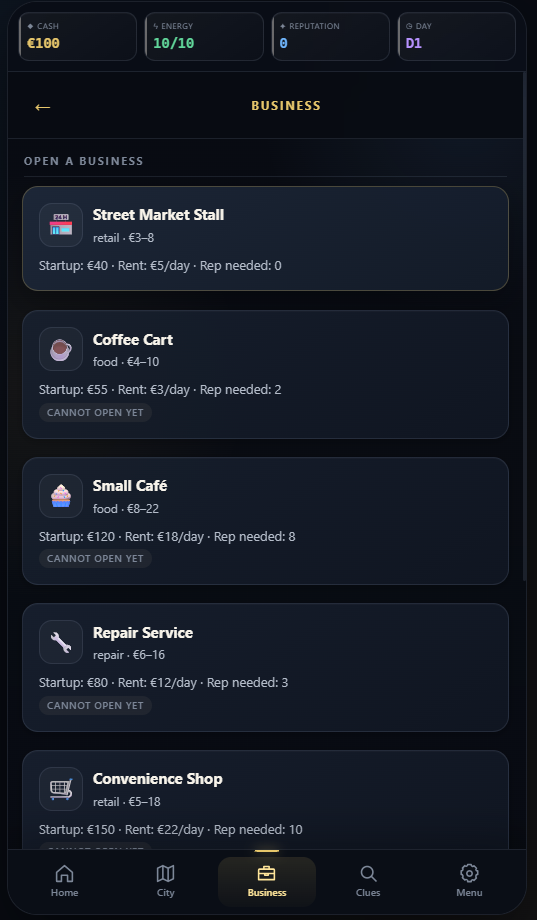
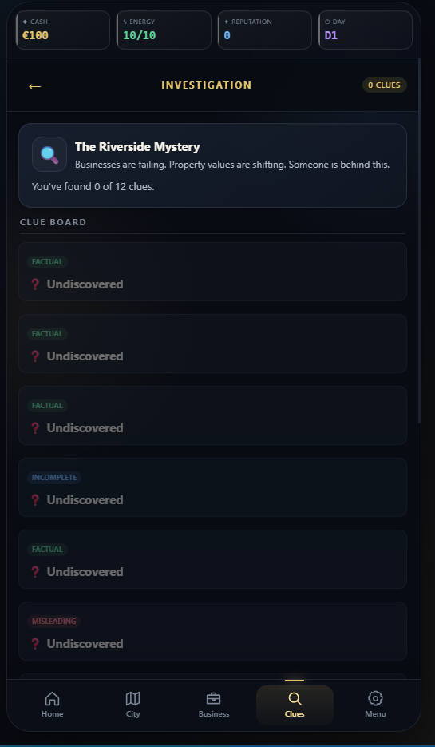

# The Empire

An offline, mobile-first business strategy RPG: start with €100, build a network of businesses, develop relationships, and investigate a city-wide mystery.

Built with **HTML, CSS, and JavaScript**, with **Capacitor 8** for Android packaging. This repository presents an independent portfolio prototype, not a verified store release. The implementation separates game data, simulation rules, and the interface without a front-end framework.

## Features present in the code

- A command-center dashboard tracking cash, energy, reputation, and time.
- An interactive SVG city map with neighborhoods, streets, buildings, and location markers.
- Temporary jobs, business purchases and upgrades, daily revenue and expenses.
- Employee hiring, assignment, wages, morale, and loyalty.
- Loans and repayments, property purchases, and inventory trading.
- Character conversations, relationships, trust, rival actions, and choice-driven events.
- Clue discovery and alternative resolutions to a central mystery.
- Three local save slots, automatic saving to slot 1, and Continue from the most recently saved slot.
- A guided introduction, responsive layouts, reduced-motion styles, and local developer controls.

These describe implemented systems; they are not a claim of exhaustive gameplay or device testing. See [verification and known limitations](docs/VERIFICATION.md).

## Preview

### Command Center

The main dashboard tracks cash, energy, reputation, time, and access to the game's core systems.



### City Map

The interactive city map provides access to neighborhoods, businesses, locations, and exploration.



### Business Management

Players can build and manage businesses, employees, upgrades, expenses, and revenue.



### Character and Story Interaction

The game includes character relationships, dialogue choices, clues, and a city-wide mystery.


## Run locally

Install Node.js **22 or newer**, then:

```sh
git clone https://github.com/sknox698-del/the-empire.git
cd the-empire
npm ci
npm run check
npm run dev
```

Open **http://127.0.0.1:4173**. Stop the server with Ctrl+C. Use this local server rather than opening the HTML file directly. The browser game uses no external backend or API credentials. The core preview and smoke checks use Node's built-in modules; npm dependencies supply Android tooling.

Game progress is stored in the current browser/WebView's `localStorage`. Different origins, browsers, and native installations have separate saves. Clearing site/app storage removes progress. There is no cloud account or save synchronization.

## Android

The checked-in Android project uses application ID `com.stevenstudio.empiregame`, minimum SDK 24, and compile/target SDK 36. Android is the native target; desktop/mobile browsers can run the web version. No iOS project is included.

With Android Studio, Android SDK 36, and a compatible JDK installed:

```sh
npm ci
npm run android:sync
npm run android:open
```

The Android project already exists: **do not run `android:add` on this checkout**. Sync rebuilds `www/`, copies the web application into Android, and regenerates ignored Capacitor files. Let Android Studio configure the local SDK path, select an emulator or device, and run the app. After web changes, run `npm run android:sync` again.

The existing native build versions are preserved. A fresh native build and device release validation have not been established by this repository cleanup. Signing keys and compiled APK/AAB files are intentionally excluded. See [Android setup notes](docs/ANDROID.md).

## Project structure

```text
index.html                 App shell, navigation, new game and Continue
style.css                  Responsive interface and map styling
data.js                    Businesses, characters, events, clues and balancing data
engine.js                  State, simulation and player actions
ui.js                      Screen rendering, interactions, tutorials and local saves
capacitor.config.json      Android app identity and generated web directory
scripts/
  dev-server.mjs           Local-only HTTP preview
  build-web.mjs            Copies the five runtime files into www/
  smoke-test.mjs           Node-based simulation and UI regression checks
android/                   Native Android source, resources and Gradle wrapper
docs/                      Setup, review results and known limitations
```

`www/`, dependencies, Android caches/build output, local SDK settings, and generated native web assets are not source files and are ignored.

## Development status

Playable portfolio prototype with an existing smoke suite. Metadata currently differs: npm package version `1.0.0`, game-data version `0.1.0`, and Android version name `1.0`. These original values are preserved and do not establish release maturity. There is no claim here of a published Google Play release, production users, multiplayer, or completed accessibility certification.

As a portfolio sample, the project demonstrates a data-driven simulation, event/state handling, browser persistence, a responsive interface, and Android packaging. Known issues and validation boundaries are documented rather than hidden behind release claims.

## Rights

No open-source license has been granted for the original project in this repository. Public visibility does not imply permission to reuse or redistribute it. Third-party components retain their own licenses; see [third-party notes](docs/THIRD_PARTY.md).
